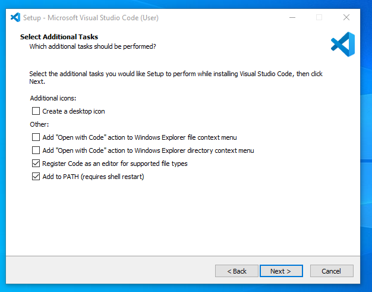
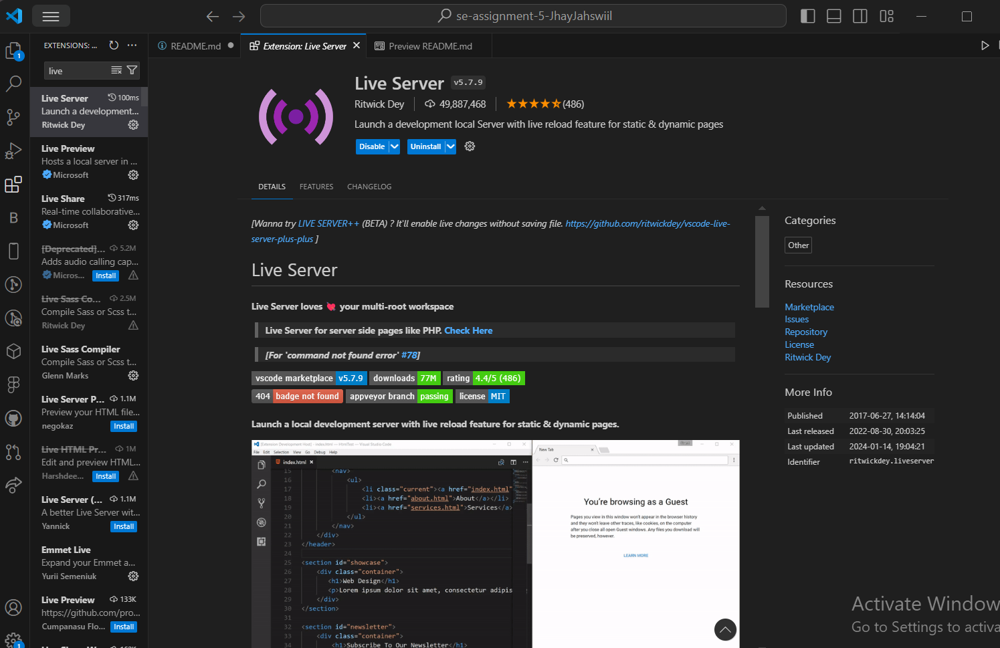

# SE-Assignment-5
Installation and Navigation of Visual Studio Code (VS Code)
 Instructions:
Answer the following questions based on your understanding of the installation and navigation of Visual Studio Code (VS Code). Provide detailed explanations and examples where appropriate.

 Questions:

1. Installation of VS Code:
   - Describe the steps to download and install Visual Studio Code on Windows 11 operating system. Include any prerequisites that might be needed.

Steps to Download and Install Visual Studio Code on Windows 11:

Visit the Official Website:
Go to the Visual Studio Code download page.
Download the Installer:

Click on the Windows version to download the installer.
Run the Installer:
Locate the downloaded file (usually in the Downloads folder) and double-click to run it.
Follow Installation Wizard:

Accept the license agreement.
Choose the destination location for the installation.
Select additional tasks such as creating a desktop icon or adding "Open with Code" action to Windows Explorer file context menu.
Complete Installation:

Click on the 'Install' button and wait for the installation to complete.
Launch Visual Studio Code after the installation.
Prerequisites:

There are no specific prerequisites for installing VS Code on Windows 11. It comes with all the necessary dependencies.

   

2. First-time Setup:
   - After installing VS Code, what initial configurations and settings should be adjusted for an optimal coding environment? Mention any important settings or extensions.

Initial Configurations and Settings:

Theme Selection:
Open Command Palette (Ctrl+Shift+P).
Type Preferences: Color Theme and select your preferred theme.
Font Size:

Go to File > Preferences > Settings (or press Ctrl+,).
Search for Editor: Font Size and set your preferred size.
Extensions:

Click on the Extensions icon in the Activity Bar on the side of the window.
Install essential extensions like:
Python
Prettier - Code formatter
ESLint
GitLens

3. User Interface Overview:
   - Explain the main components of the VS Code user interface. Identify and describe the purpose of the Activity Bar, Side Bar, Editor Group, and Status Bar.

Main Components of the VS Code User Interface:

Activity Bar:

Located on the far left of the window.
Contains icons for various views such as Explorer, Search, Source Control, Run and Debug, and Extensions.
Purpose: Quickly switch between different views and functionalities.

Side Bar:
Located next to the Activity Bar.
Displays the selected view from the Activity Bar, such as file explorer or search results.

Editor Group:
The central part of the interface where files are opened and edited.
Supports multiple tabs and split views for side-by-side editing.

Status Bar:
Located at the bottom of the window.
Displays information like line and column number, Git branch, errors and warnings, and language mode.

4. Command Palette:
   - What is the Command Palette in VS Code, and how can it be accessed? Provide examples of common tasks that can be performed using the Command Palette.

What is the Command Palette?

The Command Palette is a powerful tool that allows users to access all of VS Code's commands and features.
Accessing Command Palette:
Press Ctrl+Shift+P or F1.

Examples of Common Tasks:
Opening settings: Preferences: Open Settings
Changing the theme: Preferences: Color Theme
Installing extensions: Extensions: Install Extensions
Running tasks: Tasks: Run Task

5. Extensions in VS Code:
   - Discuss the role of extensions in VS Code. How can users find, install, and manage extensions? Provide examples of essential extensions for web development.

Role of Extensions:

Extensions enhance the functionality of VS Code by adding new features or integrating with external tools and services.
Finding, Installing, and Managing Extensions:

Finding Extensions:
Click on the Extensions icon in the Activity Bar.
Search for extensions in the Extensions view.
Installing Extensions:

Click the 'Install' button next to the desired extension.
Managing Extensions:

Installed extensions can be enabled, disabled, or uninstalled from the Extensions view.
Examples of Essential Extensions for Web Development:

Live Server
HTML CSS Support
JavaScript (ES6) code snippets

   
6. Integrated Terminal:
   - Describe how to open and use the integrated terminal in VS Code. What are the advantages of using the integrated terminal compared to an external terminal?

Opening and Using the Integrated Terminal:

Opening Terminal:
Use Ctrl+`` or go to View > Terminal`.
Advantages:

Directly integrated with the editor, allowing seamless transitions between coding and terminal tasks.
Supports multiple terminals, split views, and various shells (PowerShell, Command Prompt, Git Bash, etc.).

7. File and Folder Management:
   - Explain how to create, open, and manage files and folders in VS Code. How can users navigate between different files and directories efficiently?

Creating, Opening, and Managing Files and Folders:

Creating Files/Folders:
Right-click in the Explorer view and select 'New File' or 'New Folder'.
Use Ctrl+N for a new file.
Opening Files/Folders:

Use the Explorer view to navigate and double-click to open files.
Use Ctrl+O to open a file or Ctrl+K Ctrl+O to open a folder.
Navigating Files:

Use Ctrl+P to quickly open files by name.
Use Ctrl+Tab to switch between open files.

8. Settings and Preferences:
   - Where can users find and customize settings in VS Code? Provide examples of how to change the theme, font size, and keybindings.

Finding and Customizing Settings:

Accessing Settings:

Go to File > Preferences > Settings or press Ctrl+,.
Changing Theme:

Use Preferences: Color Theme from the Command Palette.
Changing Font Size:

Search for Editor: Font Size in the settings and adjust accordingly.
Changing Keybindings:

Go to File > Preferences > Keyboard Shortcuts or press Ctrl+K Ctrl+S.

9. Debugging in VS Code:
   - Outline the steps to set up and start debugging a simple program in VS Code. What are some key debugging features available in VS Code?

Setting Up and Starting Debugging:

Open the Run and Debug View:

Click on the Run icon in the Activity Bar or press Ctrl+Shift+D.
Configure Debugger:

Click on create a launch.json file link to configure the debugger for your project.
Set Breakpoints:

Click in the gutter next to the line numbers in the editor.
Start Debugging:

Press F5 to start debugging.
Key Debugging Features:

Breakpoints
Watch Expressions
Call Stack
Variables View

10. Using Source Control:
    - How can users integrate Git with VS Code for version control? Describe the process of initializing a repository, making commits, and pushing changes to GitHub.

Integrating Git with VS Code:

Initialize Repository:

Go to the Source Control view by clicking the Source Control icon in the Activity Bar.
Click on 'Initialize Repository'.
Making Commits:

Stage changes by clicking the + icon next to the files.
Enter a commit message and click the checkmark icon to commit.
Pushing Changes to GitHub:

Click on the '...' menu in the Source Control view and select Push.
Follow prompts to set up remote repository and push changes.

 Submission Guidelines:
- Your answers should be well-structured, concise, and to the point.
- Provide screenshots or step-by-step instructions where applicable.
- Cite any references or sources you use in your answers.
- Submit your completed assignment by 1st July 

